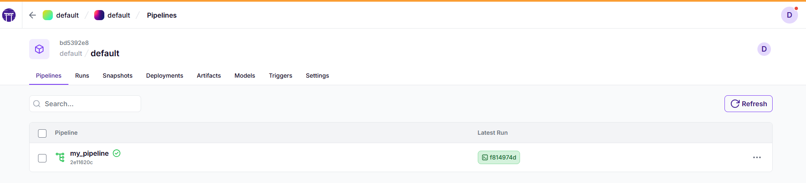

# Twin-LLM
An LLM that is your twin

# FTI (Feature, Training, Inference)
Per evitare di avere un codice monolitico che gestisce tutto, un complesso ML system viene progettato secondo il pattern Feature, Training, Inference (FTI). Ovvero dai raw data vengono estratte le feature e le etichette (Feature stage) e vengono salvate in un feature store, poi si allena il modello con le feature e salvato in un model registry (Training stage) e infine si procede con l'inferenza usando le feature nuove + feature estratte e modello allenato (Inference stage).

#Setup

conda create -n twinllm python=3.11
conda activate twinllm

Useremo poetry per gestire le dipendenze python
pip install poetry
poetry self add 'poethepoet[poetry_plugin]' <--- task execution tool (comodo)

Con poetry inizializziamo il progetto:
poetry init
Questo creerà un pyproject.toml che conterrà diverse cose come i pacchetti di cui necessita il nostro progetto. Supponiamo di voler aggiungere numpy:
potery add numpy
Spunterà in pyproject.tom:
dependencies = [
    "numpy (>=2.4.6,<3.0.0)"
]
NB: assicurati che requires-python = ">=3.11,<3.15" metti il tetto massimo a 3.15 altrimenti zenml da problemi.

# ZENML
E' un orchestratore che gestisce l'esecuzione di "funzioni" rispettandone l'ordine e garantisce l'ottimizzazione delle risorse. Se una funzione non dipende da un altra, può andare in parallelo. Ogni funzione isolata (che fa un lavoro quindi, che può anche dipendere da altre funzioni) viene decorata tramite @step. Quando si vogliono mettere insieme diverse funzioni per formare una "pipeline" si crea un'altra funzione e la si decora come @pipeline e si usano le @step function definite.

1) setup
poetry add zenml[local]
poetry add zenml[server]==0.95.1

2) Creare dataset zeml 
zenml init

3) Avviare dashboard
zenml up

3) Lanciare la pipeline
python 1_basic_concepts/1_zenml.py

Nella dashboard vedrai "graficamente" la tua pipeline:

ZenML è intelligente. Se la pipeline viene eseguita e la rieseguiamo, e capisce che nulla, rispetto a prima cambia, usa la cache. Nell'esempio, ho usato come decoratore @step(enable_cache=False) quando genero un numero randomico per far capire a ZenML che quello step non deve essere "cachato" ma ripetuto.

